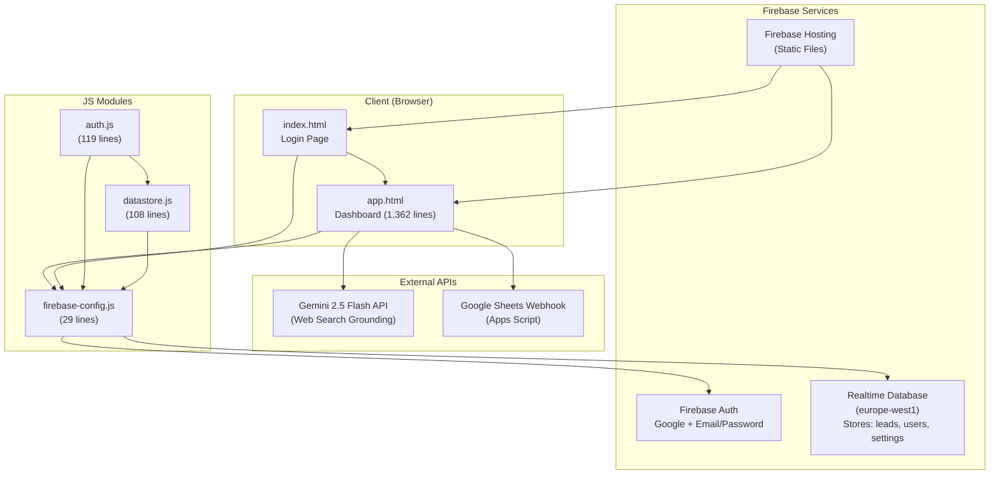
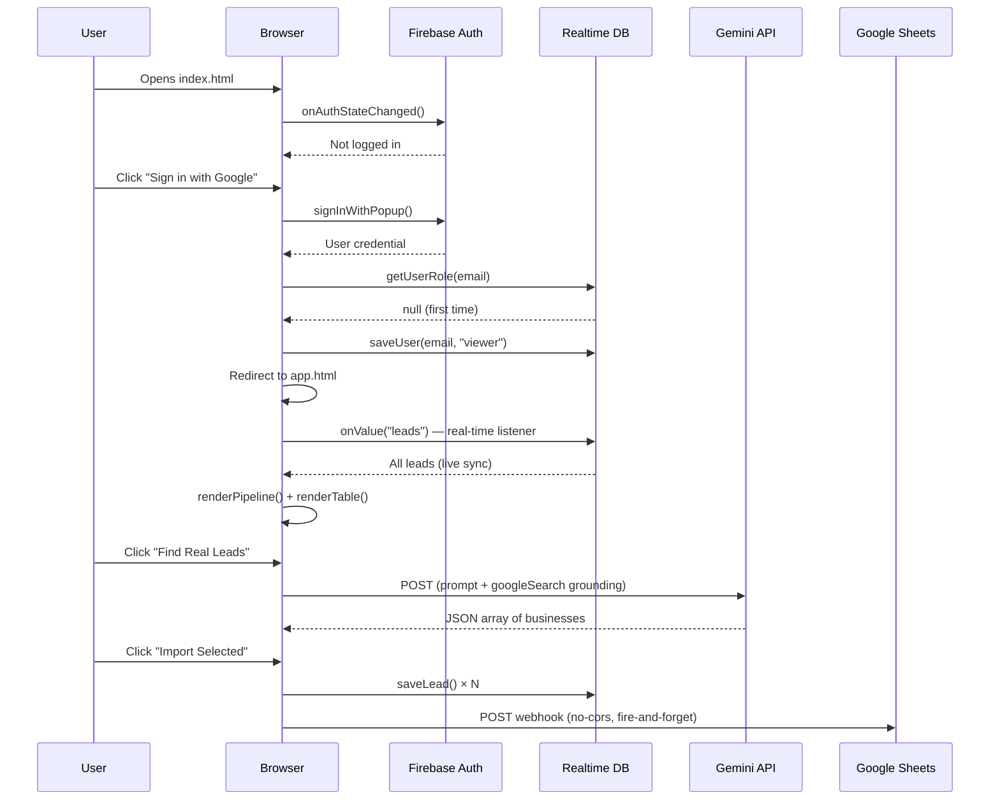
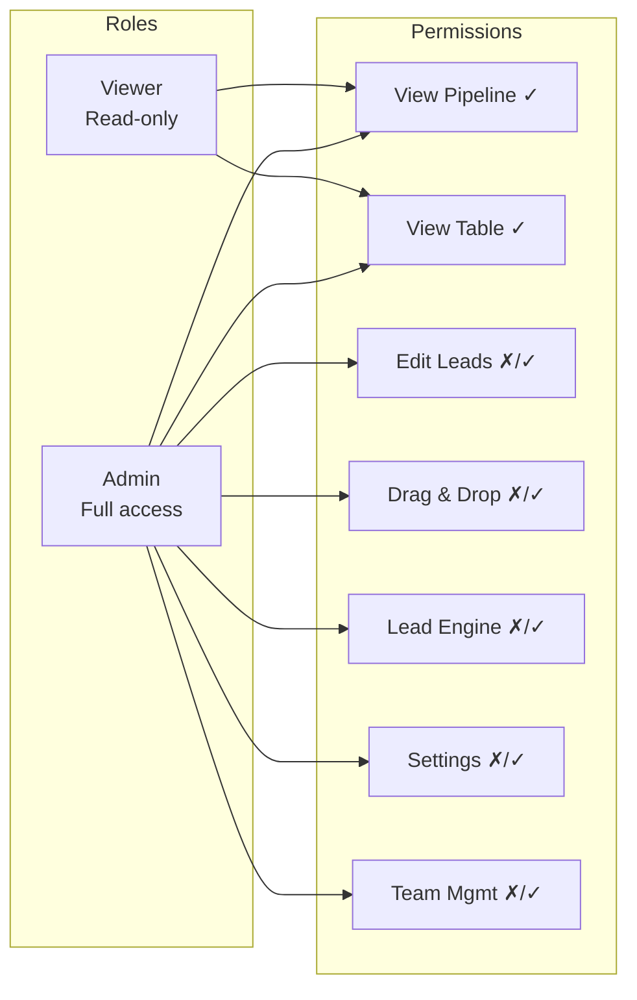

# Outreach CRM — Architecture Audit

## System Overview

Your CRM is a **static-hosted SPA** (Single Page Application) deployed on Firebase Hosting, backed by Firebase Realtime Database and Firebase Auth. It has no backend server — all logic runs client-side in the browser.

---

## Architecture Diagram

## Data Flow

## File Structure

| File | Size | Role |
|------|------|------|
| [index.html](file:///c:/Users/Youssf/Documents/Leadgen/index.html) | 539 lines | Login page (Apple-style UI) |
| [app.html](file:///c:/Users/Youssf/Documents/Leadgen/app.html) | 1,362 lines | **Entire CRM** — CSS + HTML + all business logic |
| [firebase-config.js](file:///c:/Users/Youssf/Documents/Leadgen/js/firebase-config.js) | 29 lines | Firebase init + re-exports |
| [auth.js](file:///c:/Users/Youssf/Documents/Leadgen/js/auth.js) | 119 lines | Auth flow + role-based access control |
| [datastore.js](file:///c:/Users/Youssf/Documents/Leadgen/js/datastore.js) | 108 lines | RTDB CRUD + real-time listeners |
| [firebase.json](file:///c:/Users/Youssf/Documents/Leadgen/firebase.json) | 11 lines | Hosting config (`public: "."`) |
| `css/` | Empty | Unused directory |

## RBAC Model

**Auto-provisioning**: New sign-ups automatically get `viewer` role. Hardcoded admin emails get `admin`.

---

## Critique

### 🔴 Critical Issues

#### 1. **API Key Exposed in Client-Side Code**
[firebase-config.js:7](file:///c:/Users/Youssf/Documents/Leadgen/js/firebase-config.js#L7) — The Firebase API key is embedded in client code. While Firebase API keys are *designed* to be public, the **Gemini API key** is stored in RTDB `settings/global` and fetched client-side. Anyone with database read access can steal it and run up your billing.

> [!CAUTION]
> The Gemini API key should **never** be accessible from the client. It should be called from a server function (e.g. Firebase Cloud Functions) that holds the key privately.

#### 2. **No Database Security Rules**
There are no `database.rules.json` in the project. This means your RTDB likely has overly permissive rules. Any authenticated user (even a `viewer`) can:
- **Write** to any path (overwrite admin data, delete all leads)
- **Read** settings including the Gemini API key
- **Modify** their own role from `viewer` to `admin`

> [!CAUTION]
> Without server-side rules, your RBAC is cosmetic — it only hides UI elements. A viewer can open DevTools, call `DataStore.saveUser("their@email.com", "admin")`, and become an admin.

#### 3. **1,362-Line Monolith HTML File**
`app.html` contains CSS + HTML + **every business function** (850+ lines of JavaScript) in a single file. This makes the codebase:
- Impossible to unit-test
- Painful to navigate and debug
- Prone to merge conflicts
- A maintenance nightmare as features grow

---

### 🟡 Significant Concerns

#### 4. **Dead/Orphaned Code**
- `promptClearData()` on [line 1275](file:///c:/Users/Youssf/Documents/Leadgen/app.html#L1275) still references `localStorage.removeItem('crm_leads')` — a leftover from the pre-Firebase era. It does nothing now.
- `renderActivity()` on [line 997](file:///c:/Users/Youssf/Documents/Leadgen/app.html#L997) duplicates activity rendering logic that's already done inline in `openDrawer()`.
- `switchEngineTab()` on [line 1020](file:///c:/Users/Youssf/Documents/Leadgen/app.html#L1020) is an empty function stub.
- The `css/` directory exists but is empty — all styles are inline.

#### 5. **Firestore SDK Loaded but Unused**
[firebase-config.js:3](file:///c:/Users/Youssf/Documents/Leadgen/js/firebase-config.js#L3) imports the entire Firestore SDK (`collection`, `addDoc`, `getDocs`, etc.) but the app only uses Realtime Database. This adds ~90KB of unused JavaScript that the browser downloads and parses.

#### 6. **Google Sheets Sync is Fire-and-Forget**
`syncToSheets()` uses `mode: 'no-cors'` which means:
- You **cannot read the response** (even errors are opaque)
- You have **no confirmation** whether the data actually reached Sheets
- `syncAllToSheets()` fires all requests in a rapid loop with no throttling — easily overwhelming the Apps Script endpoint

#### 7. **No Input Validation on Critical Paths**
- CSV import accepts any file, any format — a malformed file crashes silently
- The Lead Engine doesn't validate Gemini's response structure before mapping it
- Phone number normalization is absent ("+20" vs "01x" vs "201x" all treated as different leads for duplicate detection)

#### 8. **Auth Module Has Dual Error Handling**
`auth.js` uses both `alert()` (old pattern) and the new `index.html` inline error UI. The `loginWithEmail` function still calls `alert()` on failure, which bypasses the styled error component.

---

### 🟢 What's Working Well

| Aspect | Status |
|--------|--------|
| Real-time sync via RTDB `onValue` | ✅ Solid — instant multi-user updates |
| Auto-provisioning new users | ✅ Clean pattern |
| CSV parser with quote-aware parsing | ✅ Better than most naive implementations |
| Duplicate detection on import (by phone) | ✅ Good guard |
| Gemini Web Search grounding for lead gen | ✅ Innovative use of the API |
| Apple-style UI with glassmorphism | ✅ Premium aesthetic |

---

## Recommended Next Steps (Priority Order)

| # | Action | Effort | Impact |
|---|--------|--------|--------|
| 1 | **Add RTDB security rules** — enforce read/write by role server-side | 30 min | 🔴 Critical |
| 2 | **Move Gemini calls to Cloud Functions** — protect the API key | 1-2 hours | 🔴 Critical |
| 3 | **Extract JS from app.html** into modules (`pipeline.js`, `table.js`, `engine.js`, `sheets.js`) | 2-3 hours | 🟡 High |
| 4 | **Remove unused Firestore imports** from firebase-config.js | 5 min | 🟢 Easy |
| 5 | **Fix dead code** (`promptClearData`, duplicate `renderActivity`, empty `switchEngineTab`) | 15 min | 🟢 Easy |
| 6 | **Add retry + confirmation to Sheets sync** | 30 min | 🟡 Medium |
| 7 | **Normalize phone numbers** before duplicate check (strip spaces, +20 prefix) | 20 min | 🟡 Medium |

---

> [!IMPORTANT]
> The #1 priority is **database security rules**. Right now, any logged-in viewer can escalate to admin or delete all your data using browser DevTools. Everything else is secondary.
